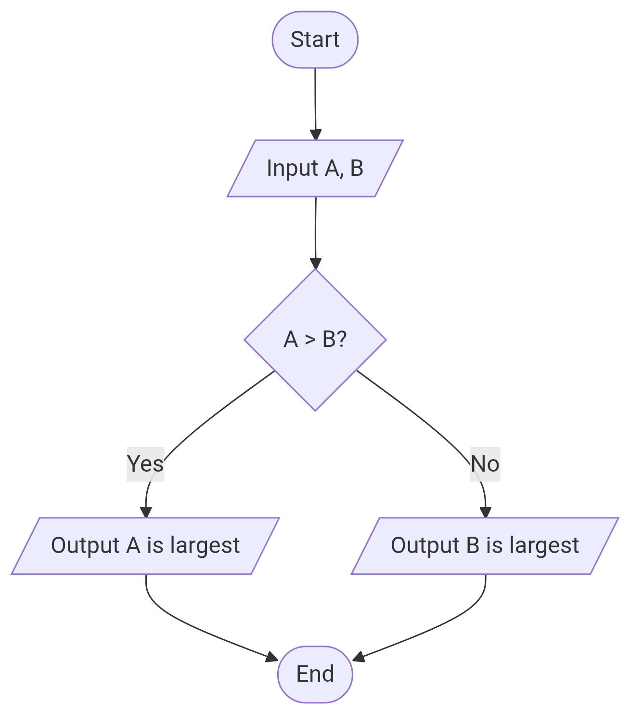

# Algorithm, Flowchart and Pseudocode 

## Algorithm

**Definition:**
An algorithm is a step-by-step procedure or set of rules to solve a problem or perform a task. It is written in simple language and is independent of any programming language.
الگورتھم (Algorithm)
مطلب: الگورتھم ایک بالترتیب طریقۂ کار یا اصولوں کا مجموعہ ہے جو کسی مسئلے کو حل کرنے یا کام کرنے کے لیے استعمال ہوتا ہے۔ یہ سادہ زبان میں لکھا جاتا ہے اور کسی بھی پروگرامنگ لینگویج سے آزاد ہوتا ہے۔

**Key points / اہم نکات:**

Written in natural language or very simple instructions.
قدرتی زبان یا سادہ ہدایات میں لکھا جاتا ہے۔

Focuses on logic and sequence of steps.
منطق اور مراحل کی ترتیب (sequence) پر توجہ دیتا ہے۔

No strict syntax like programming language.
پروگرامنگ لینگویج جیسا سخت syntax نہیں ہوتا۔

**Example (Finding the largest of two numbers / دو نمبروں میں بڑا نمبر معلوم کرنا):**

1. Start / شروع کریں

2. Read number1, number2 / نمبر1 اور نمبر2 پڑھیں

3. If number1 > number2 then / اگر نمبر1 نمبر2 سے بڑا ہے تو

Print "number1 is largest" / نمبر1 سب سے بڑا ہے پرنٹ کریں

Else / ورنہ

Print "number2 is largest" / نمبر2 سب سے بڑا ہے پرنٹ کریں

4. End / ختم

**Symbols / علامات:**
No graphical symbols; uses numbered steps or bullets.
کوئی گرافیکل علامت نہیں؛ صرف نمبر یا بلٹس استعمال ہوتے ہیں۔

---

## 2. Flowchart 

**Definition:**
A flowchart is a graphical representation of an algorithm, showing the flow of steps using symbols.
فلوچارٹ (Flowchart)
مطلب: فلوچارٹ الگورتھم کی گرافیکل تصویر ہے، جس میں مراحل کی ترتیب علامات (symbols) کے ذریعے دکھائی جاتی ہے۔

**Key points / اہم نکات:**

Shows sequence and decision making clearly.
مراحل کی ترتیب اور فیصلے واضح دکھاتا ہے۔

Easy to visualize.
دیکھنے میں آسان۔

Each operation has a specific symbol.
ہر عمل کے لیے خاص علامت ہے۔

**Example:**

**Common Symbols in Flowcharts / عام علامات:**

| Symbol | Name       | Purpose / مقصد |
|--------|------------|----------------|
| ⬜      | Process    | Represents a process or operation / کسی عمل یا پروسیس کی نمائندگی |
| ⬛      | Input/Output | Represents input (read) or output (print) / ان پٹ یا آؤٹ پٹ کی نمائندگی |
| 🔷      | Decision   | Represents a decision (Yes/No) / فیصلے کی نمائندگی |
| ⭘      | Terminal  | Start or End / شروع یا ختم |
| →      | Arrow      | Shows flow of control / مراحل کی ترتیب دکھاتا ہے |

Example (Finding largest of two numbers / دو نمبروں میں بڑا نمبر):
Start → Read numbers → Decision (num1 > num2?) → Output largest → End

---

## 3. Pseudocode

**Definition:**
Pseudocode is a detailed, structured version of an algorithm, written in plain English (or simple programming-like statements), before actual coding.
پسوڈو کوڈ (Pseudocode)
مطلب: پسوڈو کوڈ الگورتھم کا مرتب اور واضح انداز ہے، جو سادہ انگریزی یا پروگرامنگ جیسے جملوں میں لکھا جاتا ہے، اصل کوڈ سے پہلے۔

**Key points / اہم نکات:**

Combines algorithmic steps and programming structure.
الگورتھم کے مراحل اور پروگرامنگ کی ساخت کو ملاتا ہے۔

Used to bridge human logic and programming code.
انسانی منطق اور پروگرامنگ کوڈ کے درمیان رابطہ قائم کرتا ہے۔

Easier to convert to any programming language.
کسی بھی پروگرامنگ لینگویج میں آسانی سے تبدیل کیا جا سکتا ہے۔

**Example (Finding largest of two numbers / دو نمبروں میں بڑا نمبر):**

BEGIN
   READ number1, number2
   IF number1 > number2 THEN
       PRINT "Number1 is largest"
   ELSE
       PRINT "Number2 is largest"
   ENDIF
END

**Symbols / علامات:**
No graphical symbols. Uses keywords like BEGIN, END, IF, ELSE, WHILE, FOR, etc.
کوئی گرافیکل علامت نہیں؛ صرف keywords جیسے BEGIN, END, IF, ELSE, WHILE, FOR استعمال ہوتے ہیں۔

---

**Note:-**
Koi b problem solve krtay waqt:
Algorithm hamesha likhna mandatory hai.
Flowchart aur Pseudocode optional hain kiunki ye donu **Problem - Analysis - Coding - Execution Cycle** m include nahi h, lekin alagh questions in par bhi aa sakte hain.Islye practice karna zaruri hai, taake exam me easily draw ya likh sakein.

## ✅ Summary Tip / خلاصہ

Algorithm: Think of it as the steps you write to solve a problem.
الگورتھم: الگورتھم بالترتیب وہ مراحل (steps) ہیں جو آپ لکھ کر مسئلہ حل کرتے ہیں۔

Flowchart: Think of it as the picture showing each step and decision.
فلوچارٹ: فلوچارٹ ہر مرحلے اور فیصلہ دکھانے والی تصویر ہے۔

Pseudocode: Think of it as the rough work of code before writing the real program.
پسوڈو کوڈ: پسوڈو کوڈ اصل پروگرام لکھنے سے پہلے کا عارضی کام ہے، جو تقریباً اصل کوڈ کی طرح ہوتا ہے۔ ✅
