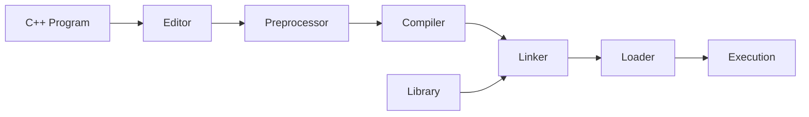
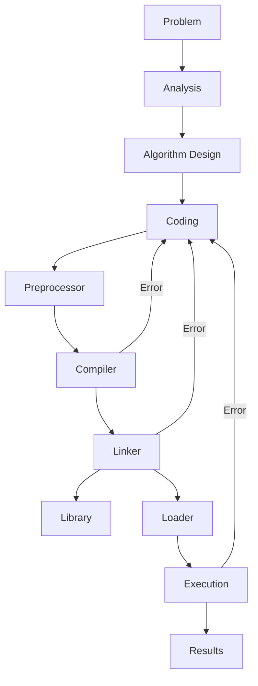

````markdown
# 📘 Chapter 1 – An Overview of Computers and Programming Languages  
_From C++ Programming: From Problem Analysis to Program Design, Fifth Edition_

---

## The Evolution of Programming Languages
- High-level languages include: **BASIC, FORTRAN, COBOL, Pascal, C, C++, C#, Java**.  
- **Compiler**: translates a program written in a high-level language into machine language.  

---

## Processing a C++ Program

### Example Program
```cpp
#include <iostream>
using namespace std;

int main() {
    cout << "My first C++ program." << endl;
    return 0;
}
````

**Sample Run:**

```
My first C++ program.
```

---

### Steps to Execute a C++ Program

1. **Editor** – Create a source program in C++.
2. **Preprocessor** – Processes directives beginning with `#`.
3. **Compiler** –

   * Checks that the program follows the rules.
   * Translates into machine language (**object program**).
4. **Linker** –

   * Combines the object program with other programs provided by the SDK.
   * Produces executable code.
5. **Loader** – Loads the executable program into main memory.
6. **Execution** – The CPU executes the program instructions.

### Mermaid Diagram – Processing a C++ Program



---

## Programming with the Problem Analysis–Coding–Execution Cycle

* Programming is a **process of problem solving**.
* One common technique:

  1. **Analyze the problem**
  2. **Outline the requirements**
  3. **Design steps (algorithm)** to solve the problem

### Algorithm

* A **step-by-step process** for problem solving.
* Provides a solution in a finite amount of time.

---

## The Problem Analysis–Coding–Execution Cycle

1. **Problem Analysis** – Define and design algorithm.
2. **Coding** – Write in C++, compile, fix errors.

   * If compiler finds errors → correct and recompile.
   * If no syntax errors → compiler generates machine code.
   * Linker links machine code with system resources.
3. **Execution** –

   * Loader places program into memory.
   * CPU executes the program.
   * Note: Compiler ensures syntax correctness, but not logical correctness.

### Mermaid Diagram – Problem Analysis–Coding–Execution Cycle



---

## Example 1-1 – Rectangle Perimeter and Area

**Formulas:**

* Perimeter = `2 * (length + width)`
* Area = `length * width`

**Algorithm:**

1. Get length of the rectangle.
2. Get width of the rectangle.
3. Compute perimeter = `2 * (length + width)`.
4. Compute area = `length * width`.

---

```


```
