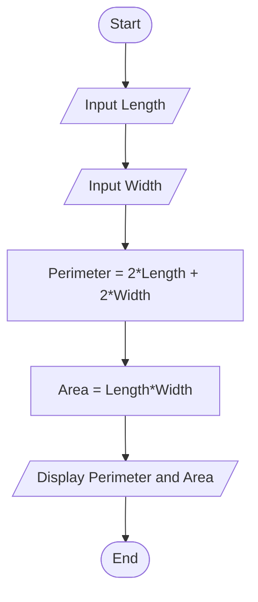
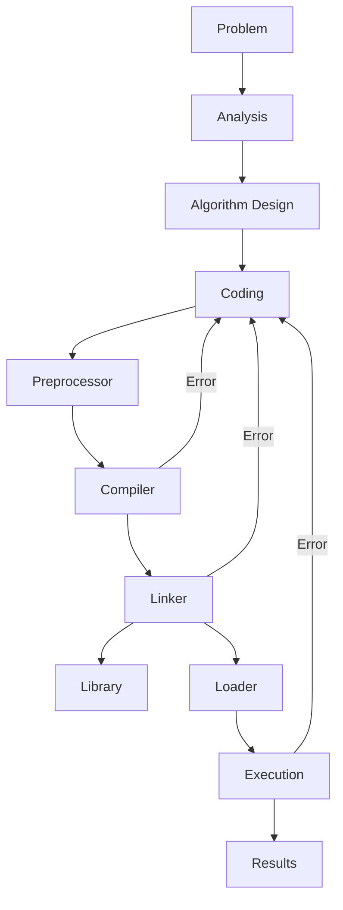

# 📘 Chapter 1 – An Overview of Computers and Programming Languages  
_From C++ Programming: From Problem Analysis to Program Design, Fifth Edition_

---

## Evolution of Programming Languages۔                                                                                   
پروگرامنگ لینگویجز کا ارتقا

How programming languages changed and improved step by step from old to modern.

پروگرامنگ لینگویجز میں وقت کے ساتھ ہونے والی تبدیلی اور بہتری۔

1. **Machine Language (مشین لینگویج) – 1940s**  
   - Programs written only in **0s and 1s (binary code)**.  
   - Directly understood by computer hardware.  
   - Very hard for humans to write and understand.  

   **مشین لینگویج (1940s)**  
   - پروگرام صرف **0 اور 1** میں لکھے جاتے تھے۔  
   - یہ زبان براہِ راست کمپیوٹر سمجھتا تھا۔  
   - انسانوں کے لیے لکھنا اور سمجھنا بہت مشکل تھا۔  

---

2. **Assembly Language (اسمبلی لینگویج) – 1950s**  
   - Used short symbolic words (mnemonics) like **ADD, SUB, MOV** instead of 0s and 1s.  
   - Needed an **Assembler (اسمبلر)** to translate into machine language.  

   **اسمبلی لینگویج (1950s)**  
   - اس میں **ADD, SUB, MOV** جیسے الفاظ استعمال ہوتے تھے بجائے 0 اور 1 کے۔  
   - اسے مشین لینگویج میں بدلنے کے لیے **اسمبلر** کی ضرورت تھی۔  

---

3. **High-Level Languages (ہائی لیول لینگویجز) – late 1950s to present**  
   - Programs written in English-like words.  
   - Needed a **Compiler (کمپائلر)** or **Interpreter (انٹرپریٹر)**.  
   - Examples: **FORTRAN (1957), COBOL (1959), BASIC (1964), Pascal (1970), C (1972)****C++ (1983), Java (1995), C# (2000)**, **Python, JavaScript, PHP, Swift (2014), Kotlin (2016), Rust (2010), Go (2009), TypeScript (2012)**.  


پروگرام ایسے الفاظ میں لکھے جاتے ہیں جو انگلش جیسے ہوتے ہیں۔

ان پروگرامز کو چلانے کے لیے کمپائلر (Compiler) یا انٹرپریٹر (Interpreter) کی ضرورت ہوتی ہے۔

مثالیں: FORTRAN (1957), COBOL (1959), BASIC (1964), Pascal (1970), C (1972), C++ (1983), Java (1995), C# (2000)، اور جدید زبانیں جیسے Python, JavaScript, PHP, Swift (2014), Kotlin (2016), Rust (2010), Go (2009), TypeScript (2012)۔


**Compiler:**
A compiler is a translator program that translates the entire code at once from a high-level language into machine language.

کمپائلر (Compiler): کمپائلر ایک ترجمہ کرنے والا پروگرام ہے جو ہائی لیول لینگویج کے پورے کوڈ کو ایک ساتھ مشین لینگویج میں بدل دیتا ہے۔


**Interpreter:** An interpreter is a translator program that translates and executes the code line by line written in a high-level language.

انٹرپریٹر (Interpreter): انٹرپریٹر ایک ترجمہ کرنے والا پروگرام ہے جو ہائی لیول لینگویج میں لکھے گئے کوڈ کو لائن بہ لائن ترجمہ کرتا ہے اور ساتھ ہی ساتھ چل بھیاتا ہے۔


**Compiler** is used to translate C++ language and some other high level languages into machine language.


---

## Processing a C++ Program

### Example Program
```cpp
#include <iostream>
using namespace std;

int main() {
    cout << "My first C++ program." << endl;
    return 0;
}
```

**Sample Run:**

```
My first C++ program.
```

**مثال چلانے کا نتیجہ:**  
```
میرا پہلا C++ پروگرام۔
```

---

### Steps to Execute a C++ Program

1. **Editor** – Create a source program in C++.  
   1. **ایڈیٹر (Editor)** – اس میں ہم C++ میں سورس پروگرام لکھتے ہیں۔  

2. **Preprocessor** – Processes directives beginning with `#`.  
   2. **پری پروسیسر (Preprocessor)** – یہ `#` سے شروع ہونے والے کمانڈز کو پروسیس کرتا ہے۔  

3. **Compiler** –  
   * Checks that the program follows the rules.  
   * Translates into machine language (**object program**).  
   3. **کمپائلر (Compiler)** –  
      * چیک کرتا ہے کہ پروگرام کے اصول صحیح ہیں یا نہیں۔  
      * پروگرام کو **مشین لینگویج** (آبجیکٹ پروگرام) میں ترجمہ کرتا ہے۔  

4. **Linker** –  
   * Combines the object program with other programs such as libraries provided by the SDK.  
   * Produces executable code.  
   4. **لنکر (Linker)** –  
      * آبجیکٹ پروگرام کو دوسری لائبریریز کے ساتھ ملاتا ہے۔  
      * اور پھر **چلنے کے قابل پروگرام** بناتا ہے۔  

5. **Loader** – Loads the executable program into main memory.  
   5. **لوڈر (Loader)** – یہ چلنے کے قابل پروگرام کو مین میموری (RAM) میں رکھتا ہے۔  
   _(زیادہ تفصیل کہ پروگرام RAM میں کیسے جاتا ہے اور CPU اس کو کیسے چلاتا ہے آپریٹنگ سسٹم کے کورس میں پڑھائی جائے گی)_  

6. **Execution** – The CPU executes the program instructions.  
   6. **ایگزی کیوشن (Execution)** – CPU پروگرام کی ہدایات چلاتا ہے۔  

---

### Mermaid Diagram – Processing a C++ Program



---

## Programming with the Problem Analysis–Coding–Execution Cycle

* Programming is a **process of problem solving**.  
* پروگرامنگ دراصل **مسئلے حل کرنے کا عمل** ہے۔  

* One common technique:  
* ایک عام طریقہ یہ ہے:  

  1. **Analyze the problem**  
     1. مسئلے کو سمجھنا (**پروبلم اینالیسز**)  
  2. **Outline the requirements**  
     2. ضروریات لکھنا (**ریکوائرمنٹس**)  
  3. **Design steps (algorithm)** to solve the problem  
     3. مسئلہ حل کرنے کے لیے قدم بہ قدم طریقہ کار (**الگوردم**) بنانا  

---

### Algorithm

 A **step-by-step process** for problem solving.  
**الگورتھم ایک بالترتیب عمل ** ہے جس سے مسئلہ حل کیا جاتا ہے۔  

Steps are followed in sequence →  کو تسلسل(ترتیب) کے ساتھ کیا جاتا ہے steps

---

## The Problem Analysis–Coding–Execution Cycle

1. **Problem Analysis** – Define and design algorithm.  
   1. **پروبلم اینالیسز** – مسئلہ سمجھنا اور الگوردم ڈیزائن کرنا۔  

2. **Coding** – Write in C++, compile, fix errors.  
   * If compiler finds errors → correct and recompile.  
   * If no syntax errors → compiler generates machine code.  
   * Linker links machine code with other programs such as libraries provided by sdk.  
   2. **کوڈنگ (Coding)** – C++ میں لکھنا، کمپائل کرنا اور غلطیاں درست کرنا۔  
      * اگر غلطی ہو → درست کریں اور دوبارہ کمپائل کریں۔  
      * اگر غلطی نہ ہو → کمپائلر مشین کوڈ بناتا ہے۔  
      * لنکر اس کوڈ کو سسٹم ریسورسز کے ساتھ جوڑتا ہے۔  

3. **Execution** –  
   * Loader places program into memory.  
   * CPU executes the program.  
   * Note: Compiler ensures syntax correctness, but not logical correctness.  
   3. **ایگزی کیوشن (Execution)** –  
      * لوڈر پروگرام کو میموری میں رکھتا ہے۔  
      * CPU پروگرام چلاتا ہے۔  
      * یاد رکھیں: کمپائلر صرف اصولوں (syntax) کو دیکھتا ہے، لیکن منطق (logic) کی درستگی نہیں دیکھتا۔  

---

### Mermaid Diagram – Problem Analysis–Coding–Execution Cycle



---

## Example:

**📝 Problem 1-1: Find the Perimeter and Area of Rectangle**


🔹 Step-01: Problem

We need to calculate the perimeter and area of a rectangle when its length and width are given.


---

🔹 Step-02: Analysis.                                                                                            تجزیہ ۔

Formulas:

Perimeter = 2 * (length + width)

Area = length * width


فارمولے:

پَرا میٹر = 2 * (لمبائی + چوڑائی)

ایریا = لمبائی * چوڑائی


---

🔹 Step-03: Algorithm

English:

1. Start


2. Input length of rectangle


3. Input width of rectangle


4. Compute perimeter = 2 * (length + width)


5. Compute area = length * width


6. Display perimeter and area


7. End


اردو:

1. شروع کریں


2. مستطیل کی لمبائی لیں


3. مستطیل کی چوڑائی لیں


4. پَرا میٹر نکالیں = 2 * (لمبائی + چوڑائی)


5. ایریا نکالیں = لمبائی * چوڑائی


6. پَرا میٹر اور ایریا دکھائیں


7. ختم کریں


---

🔹 Step-04: Flowchart


---

🔹 Step-05: Coding using C++ language 

Use an appropriate **code editor** to write and execute(run) the code.


#include <iostream>  // Preprocessor directive for input/output
using namespace std;

// Note:- Comments are used to explain code and make it easier to understand and translator ignore the comments and don't translates the comments.


int main() {
    // Purpose of this program: Calculate Perimeter and Area of a rectangle
   
    // Step 1: Declare variables
    float length, width, perimeter, area;  // Variables to store input and results

    // Step 2: Take input from user
    cout << "Enter length of rectangle: ";  // Asking user for length
    cin >> length;                          // Reading length
    cout << "Enter width of rectangle: ";   // Asking user for width
    cin >> width;                           // Reading width

    // Step 3: Perform calculations
    perimeter = 2 * (length + width);  // Formula for perimeter
    area = length * width;             // Formula for area

    // Step 4: Display the results
    cout << "Perimeter of Rectangle = " << perimeter << endl;  // Print perimeter
    cout << "Area of Rectangle = " << area << endl;            // Print area

    return 0;  // End of program
}


---

🔹 Step-06: Preprocessing

👉 The preprocessor handles #include <iostream> and other directives.


---

🔹 Step-07: Compilation

👉 Compiler checks syntax and converts source code into object code.


---

🔹 Step-08: Linking

👉 The linker connects object code with libraries like iostream.


---

🔹 Step-09: Loading

👉 The loader loads the executable into memory.


---

🔹 Step-10: Execution

👉 Program runs, takes input, performs calculations, and shows results.


---

🔹 Step-11: Output / Results

Input:

Enter length of rectangle: 10
Enter width of rectangle: 5

Output:

Perimeter of Rectangle = 30
Area of Rectangle = 50

---

