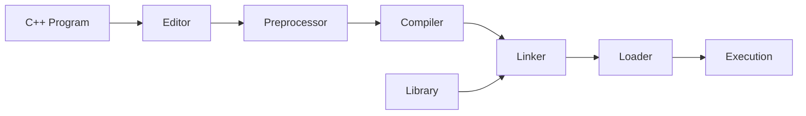
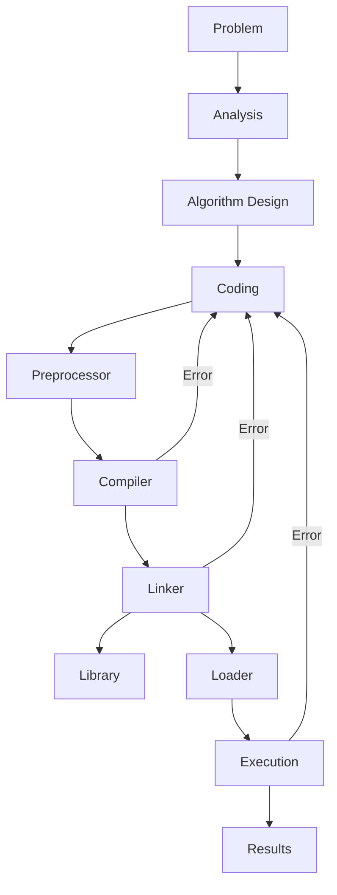

# 📘 Chapter 1 – An Overview of Computers and Programming Languages  
_From C++ Programming: From Problem Analysis to Program Design, Fifth Edition_

---

## The Evolution of Programming Languages
- High-level languages include: **BASIC, FORTRAN, COBOL, Pascal, C, C++, C#, Java**.  
- **ہائی لیول لینگویجز (High-level languages)** میں شامل ہیں: **BASIC, FORTRAN, COBOL, Pascal, C, C++, C#, Java**۔  

- **Compiler**: translates a program written in a high-level language into machine language.  
- **کمپائلر (Compiler)**: ایک پروگرام ہے جو ہائی لیول لینگویج میں لکھے گئے پروگرام کو **مشین لینگویج** میں بدلتا ہے۔  

---

## Processing a C++ Program

### Example Program
```cpp
#include <iostream>
using namespace std;

int main() {
    cout << "My first C++ program." << endl;
    return 0;
}
```

**Sample Run:**

```
My first C++ program.
```

**مثال چلانے کا نتیجہ:**  
```
میرا پہلا C++ پروگرام۔
```

---

### Steps to Execute a C++ Program

1. **Editor** – Create a source program in C++.  
   1. **ایڈیٹر (Editor)** – اس میں ہم C++ میں سورس پروگرام لکھتے ہیں۔  

2. **Preprocessor** – Processes directives beginning with `#`.  
   2. **پری پروسیسر (Preprocessor)** – یہ `#` سے شروع ہونے والے کمانڈز کو پروسیس کرتا ہے۔  

3. **Compiler** –  
   * Checks that the program follows the rules.  
   * Translates into machine language (**object program**).  
   3. **کمپائلر (Compiler)** –  
      * چیک کرتا ہے کہ پروگرام کے اصول صحیح ہیں یا نہیں۔  
      * پروگرام کو **مشین لینگویج** (آبجیکٹ پروگرام) میں ترجمہ کرتا ہے۔  

4. **Linker** –  
   * Combines the object program with other programs such as libraries provided by the SDK.  
   * Produces executable code.  
   4. **لنکر (Linker)** –  
      * آبجیکٹ پروگرام کو دوسری لائبریریز کے ساتھ ملاتا ہے۔  
      * اور پھر **چلنے کے قابل پروگرام** بناتا ہے۔  

5. **Loader** – Loads the executable program into main memory.  
   5. **لوڈر (Loader)** – یہ چلنے کے قابل پروگرام کو مین میموری (RAM) میں رکھتا ہے۔  
   _(زیادہ تفصیل کہ پروگرام RAM میں کیسے جاتا ہے اور CPU اس کو کیسے چلاتا ہے آپریٹنگ سسٹم کے کورس میں پڑھائی جائے گی)_  

6. **Execution** – The CPU executes the program instructions.  
   6. **ایگزی کیوشن (Execution)** – CPU پروگرام کی ہدایات چلاتا ہے۔  

---

### Mermaid Diagram – Processing a C++ Program



---

## Programming with the Problem Analysis–Coding–Execution Cycle

* Programming is a **process of problem solving**.  
* پروگرامنگ دراصل **مسئلے حل کرنے کا عمل** ہے۔  

* One common technique:  
* ایک عام طریقہ یہ ہے:  

  1. **Analyze the problem**  
     1. مسئلے کو سمجھنا (**پروبلم اینالیسز**)  
  2. **Outline the requirements**  
     2. ضروریات لکھنا (**ریکوائرمنٹس**)  
  3. **Design steps (algorithm)** to solve the problem  
     3. مسئلہ حل کرنے کے لیے قدم بہ قدم طریقہ کار (**الگوردم**) بنانا  

---

### Algorithm

* A **step-by-step process** for problem solving.  
* الگوردم ایک **قدم بہ قدم طریقہ** ہے جس سے مسئلہ حل کیا جاتا ہے۔  

* Provides a solution in a finite amount of time.  
* یہ ایک محدود وقت میں حل فراہم کرتا ہے۔  

---

## The Problem Analysis–Coding–Execution Cycle

1. **Problem Analysis** – Define and design algorithm.  
   1. **پروبلم اینالیسز** – مسئلہ سمجھنا اور الگوردم ڈیزائن کرنا۔  

2. **Coding** – Write in C++, compile, fix errors.  
   * If compiler finds errors → correct and recompile.  
   * If no syntax errors → compiler generates machine code.  
   * Linker links machine code with other programs such as libraries provided by sdk.  
   2. **کوڈنگ (Coding)** – C++ میں لکھنا، کمپائل کرنا اور غلطیاں درست کرنا۔  
      * اگر غلطی ہو → درست کریں اور دوبارہ کمپائل کریں۔  
      * اگر غلطی نہ ہو → کمپائلر مشین کوڈ بناتا ہے۔  
      * لنکر اس کوڈ کو سسٹم ریسورسز کے ساتھ جوڑتا ہے۔  

3. **Execution** –  
   * Loader places program into memory.  
   * CPU executes the program.  
   * Note: Compiler ensures syntax correctness, but not logical correctness.  
   3. **ایگزی کیوشن (Execution)** –  
      * لوڈر پروگرام کو میموری میں رکھتا ہے۔  
      * CPU پروگرام چلاتا ہے۔  
      * یاد رکھیں: کمپائلر صرف اصولوں (syntax) کو دیکھتا ہے، لیکن منطق (logic) کی درستگی نہیں دیکھتا۔  

---

### Mermaid Diagram – Problem Analysis–Coding–Execution Cycle



---

## Example 1-1 – Rectangle Perimeter and Area

**Formulas:**  
* Perimeter = `2 * (length + width)`  
* Area = `length * width`  

**فارمولے:**  
* پَرا میٹر = `2 * (لمبائی + چوڑائی)`  
* ایریا = `لمبائی * چوڑائی`  

---

**Algorithm:**  
1. Get length of the rectangle.  
2. Get width of the rectangle.  
3. Compute perimeter = `2 * (length + width)`.  
4. Compute area = `length * width`.  

**الگوردم:**  
1. مستطیل کی لمبائی لیں۔  
2. مستطیل کی چوڑائی لیں۔  
3. پَرا میٹر نکالیں = `2 * (لمبائی + چوڑائی)`۔  
4. ایریا نکالیں = `لمبائی * چوڑائی`۔  

---
